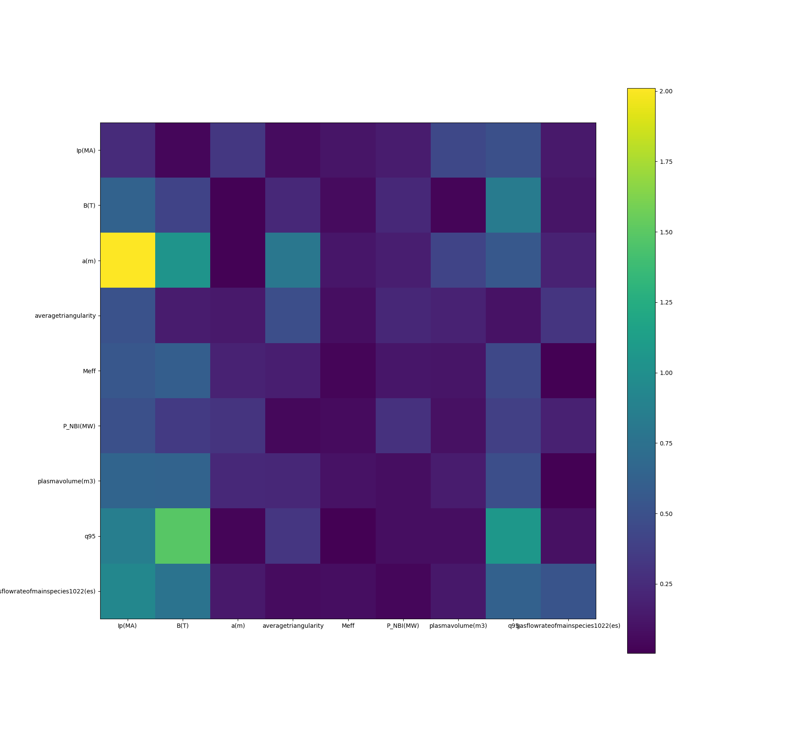

# Meta-modeling via joint distributions

- Compare joint distributions of main engineering params and neped
- split dataset into subsets of joint distributions
- train models on subsets
- compare
	- if bayes, how to coeff changes
	- general prediction quality
	- UQ

Table ideas in pictures

### Initial Results

- Had to remove cross correlated Ps, left NBI
- Standard Scaling (0, 1)
- splits are hand made
- Current matrix shows the relative changes in coeficinets between the splits for each variable
- **a** has big change when Ip is split
- **BT** changes somewhere
- Ip obviously plays a big roll

### Next Steps

- Check coefs with RFs
- Check RMSE difference for linreg (requires CV? can check also against the other split.)
